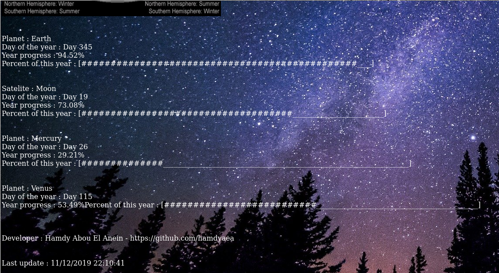

   
# SolarSystemPercentage  
 
 Developer : Hamdy Abou El Anein     
 hamdy.aea@protonmail.com   
 This programm is not finish, I am working on it    

The index.html page is created in /var/www/html/    
Put the pictures and the json file in the same directory to make it run.

```sh

 __     __               _   __                                                                                                       
 \ \   / /              (_) / /                                                                                                       
  \ \_/ /__  __ _ _ __     / /                                                                                                        
   \   / _ \/ _` | '__|   / /  
    | |  __/ (_| | |     / / _ 
    |_|\___|\__,_|_|    /_/ (_)


Planet : Earth
Day of the year : Day 349
Year progress : 95.62%
Percent of this year : [###############################################__]

Satelite : Moon
Day of the year : Day 23
Year progress : 88.46%
Percent of this year : [############################################_____]

Planet : Mercury
Day of the year : Day 30
Year progress : 33.71%
Percent of this year : [################_________________________________]

Planet : Venus
Day of the year : Day 119
Year progress : 55.35%
Percent of this year : [###########################______________________]


Planet : Mars
Day of the year : Day 456
Year progress : 66.28%
Percent of this year : [#################################________________]


```
# http://astrometry.ml/

