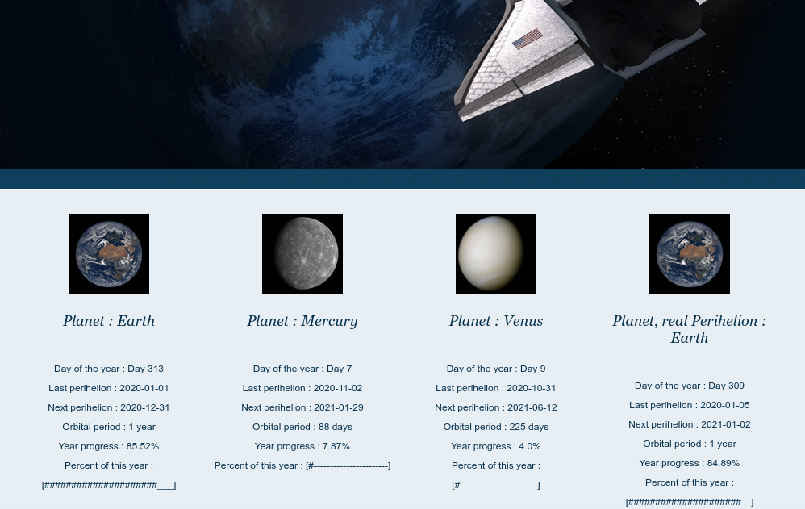

   
# SolarSystemPercentage  
 
 Developer : Hamdy Abou El Anein     
 hamdy.aea@protonmail.com   
 This programm is not finish, I am working on it  


```sh

 __     __               _   __
 \ \   / /              (_) / /
  \ \_/ /__  __ _ _ __     / / 
   \   / _ \/ _` | '__|   / /  
    | |  __/ (_| | |     / / _ 
    |_|\___|\__,_|_|    /_/ (_)


Planet : Earth
Day of the year : Day 345
Year progress : 94.52%
Percent of this year : [###############################################____]

Satelite : Moon
Day of the year : Day 19
Year progress : 73.08%
Percent of this year : [####################################__________________________]

Planet : Mercury
Day of the year : Day 26
Year progress : 29.21%
Percent of this year : [##############______________________________________________________________________]

Planet : Venus
Day of the year : Day 115
Year progress : 53.49%
Percent of this year : [##########################______________________________________________]


```
# http://astrometry.ml/

